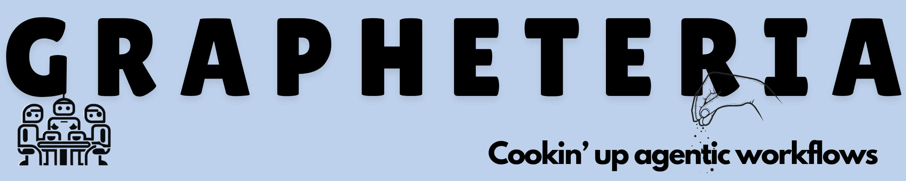

<div align="center">
  
</div>


[](https://beubax.github.io/Grapheteria/)

## What is Grapheteria?

Grapheteria is a no-BS library for creating agentic workflows. Design, visualize, and run complex processes without the headaches.

<div align="center">
  
</div>

"Oh no, not ANOTHER workflow library!" - Yeah, we hear you! But being fashionably late means we've learned from everyone else's mistakes and cherry-picked their best ideas, while adding our own secret sauce.

## 🚀 Why Grapheteria?

While agent creation and tool-calling have standards, workflow creation is still a mess. Grapheteria fixes that with a clean framework that gives you what you need while letting you extend things however you want.

### 😵‍💫 Problems with Existing Tools

**Code-based workflow builders** make your brain hurt:
- "Wait, what does this wrapper do again?" 
- "How many layers of inheritance am I dealing with?"
- "I just want to see what's happening!"

**UI-only tools** hit walls quickly:
- Can't customize for complex scenarios
- Multi-agent setups? Forget about it
- You eventually crawl back to code anyway

## 🌈 The Vision: Best of Both Worlds

Grapheteria blends code and UI seamlessly. Bounce between visual design and code customization without compromises. Get all the power of code with the clarity of visual debugging.


<!-- An animated GIF showing changes in code immediately reflected in the UI and vice versa -->

## ✅ Standout Features

### 👨‍💻 Clean, Simple Code
Write workflows without a PhD in API-ology:

```python
start_node = InputNode(id="get_name")
process_node = ProcessNode(id="greet")
output_node = OutputNode(id="display")

start_node > process_node > output_node
```

### 🎨 Visual Workflow Design
Edit visually or with code - they stay perfectly in sync!
- Drop nodes right in the UI
- Reroute your flow with a few clicks
- Debug in real-time while tweaking code
- Switch between code and UI whenever you want


<!-- A screenshot of the Grapheteria workflow editor with nodes, edges, and a properties panel -->

### ⏰ Time-Travel Debugging
Made a mistake? No sweat:
- Step backward in time
- Fix the bug
- Step forward
- Keep going from exactly where you left off


<!-- An animated GIF showing someone debugging, going back in time, fixing a node, and continuing -->

### 🧰 Built-in Essentials
- Super detailed logging
- Auto-saves your state
- Easy resume after stopping


<!-- A screenshot showing logs and state persistence in action -->

### 🏭 Production-Ready Path
From your laptop to the cloud with minimal changes:
- Scale to distributed execution
- Track everything automatically
- Handle errors like a pro


<!-- An illustration showing workflow scaling from local to distributed environments -->

### 🤖 Vibe-Coding Compatible
Describe what you want, then fine-tune:
- Generate workflows with AI
- Tweak instead of starting from scratch
- Build complex flows in minutes, not hours


<!-- An animated GIF showing a text prompt being turned into a workflow -->

## 🚦 Ready to Try It?

### Installation

```bash
# Create a virtual environment (recommended)
python -m venv venv
source venv/bin/activate  # On Windows: venv\Scripts\activate

# Install Grapheteria
pip install grapheteria
```

> **Note:** Grapheteria requires Python 3.6 or higher.

### Launch the UI

Once installed, fire up the UI with:

```bash
grapheteria
```

This starts the Grapheteria interface and automatically syncs with your code.

<div class="d-flex justify-content-center mt-4">
  <a href="Core" class="btn btn-primary btn-sm px-2 py-2 mb-4">Learn Core Concepts →</a>
</div>
