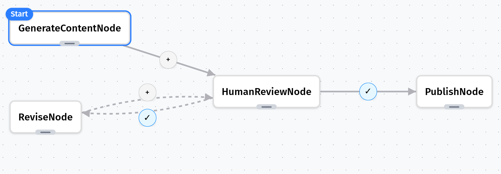

# Human-in-the-Loop Content Creation

## The Problem

Modern AI workflows often need human oversight at critical decision points. For instance, when an AI generates content, a human might need to review it before publication.

## Solution with Grapheteria

Grapheteria excels at creating human-in-the-loop workflows with minimal effort. Here's how we'll build an elegant content creation system:

- **User Input**: A user suggests a topic for an article
- **AI Generation**: The system uses AI to generate the article content
- **Human Review**: A human reviewer examines the content before publication
- **Quality Control**: If the content doesn't meet standards, the reviewer provides specific feedback
- **Iteration**: The system revises and resubmits until the content achieves the desired quality
- **Publication**: Once approved, the content moves to publication

### First, let's create our LLM utility

```python
# utils.py
from functools import lru_cache
import os
from openai import OpenAI
from dotenv import load_dotenv

# Load environment variables from .env file
load_dotenv()

@lru_cache(maxsize=1)
def get_llm_client():
    return OpenAI(api_key=os.environ.get("OPENAI_API_KEY"))

def call_llm(prompt, max_tokens=500):
    """Call OpenAI's API to generate text."""
    llm_client = get_llm_client()
    
    try:
        response = llm_client.chat.completions.create(
            model="gpt-3.5-turbo",
            messages=[
                {"role": "system", "content": "You are a helpful article writer."},
                {"role": "user", "content": prompt}
            ],
            max_tokens=max_tokens,
            temperature=0.7
        )
        return response.choices[0].message.content
    except Exception as e:
        print(f"Error calling OpenAI API: {e}")
        return f"Failed to generate article about {prompt}"


```

### Now let's create our workflow nodes

```python
# nodes.py
from grapheteria import Node
from utils import call_llm

class GenerateContentNode(Node):
    async def prepare(self, shared, request_input):
        topic = await request_input(
            prompt="What topic would you like an article about?",
            input_type="text"
        )
        shared["topic"] = topic 
        return topic

    def execute(self, topic):
        prompt = f"Write an informative article about {topic}"
        article = call_llm(prompt)
        return article

    def cleanup(self, shared, prep_result, exec_result):
        shared["article"] = exec_result

class HumanReviewNode(Node):
    async def prepare(self, shared, request_input):
        print(f"Article about '{shared['topic']}':")
        print(shared['article'][:150] + "...")
        
        response = await request_input(
            prompt="Do you approve this content?",
            options=["approve", "reject"],
            input_type="select"
        )
        
        shared["human_decision"] = response

class PublishNode(Node):
    async def prepare(self, shared, _):
        print(f"🎉 Publishing '{shared['topic']}' article")
        # In a real app, you might save to a database or CMS
        # await write_to_db(shared['article'])

class ReviseNode(Node):
    async def prepare(self, shared, request_input):
        print(f"✏️ Article needs revision")

        feedback = await request_input(
            prompt="What needs to be improved?",
            input_type="text"
        )
        return {
            'topic':shared['topic'],
            'content': shared['article'],
            'feedback': feedback
            }

    async def execute(self, data):           
        new_prompt = f"Topic: {data['topic']}. Revise this article: {data['content'][:200]}... Based on feedback: {data['feedback']}"
        revised = call_llm(new_prompt, max_tokens=700)
        return revised

    def cleanup(self, shared, prep_result, exec_result):
        shared["article"] = exec_result
```

### Define and run the workflow

```python
# main.py
from nodes import *
from grapheteria import WorkflowEngine
import asyncio

# Create nodes
generate = GenerateContentNode(id="generate_content")
review = HumanReviewNode(id="human_review")
publish = PublishNode(id="publish")
revise = ReviseNode(id="revise")

# Connect with conditional paths
generate > review
review - "shared['human_decision'] == 'approve'" > publish
review - "shared['human_decision'] == 'reject'" > revise
revise > review  # Loop back for another review

# Create the workflow engine
workflow = WorkflowEngine(
    nodes=[generate, review, publish, revise],
    start=generate
)

async def run_workflow():
    user_input = None
    
    while True:
        continue_workflow = await workflow.run(user_input)
        
        # If workflow is waiting for input
        if workflow.execution_state.awaiting_input:
            request = workflow.execution_state.awaiting_input
            request_id = request['request_id']
            prompt = request['prompt']
            
            print(f"\n[Input required] {prompt}")
            
            if request['input_type'] == 'select':
                for i, option in enumerate(request['options']):
                    print(f"{i+1}. {option}")
                choice = input("Enter your choice (number): ")
                user_input = request['options'][int(choice)-1]
            else:
                user_input = input("Your response: ")
            
            await workflow.step({request_id: user_input})
        elif not continue_workflow:
            break
            
            
if __name__ == "__main__":
    # Run the workflow
    asyncio.run(run_workflow())
```

### Workflow JSON Schema

```json
{
  "start": "generate_content",
  "nodes": [{
      "id": "generate_content",
      "class": "GenerateContentNode" },
    { "id": "human_review",
      "class": "HumanReviewNode" },
    { "id": "publish",
      "class": "PublishNode" },
    { "id": "revise",
      "class": "ReviseNode" }],
  "edges": [{
      "from": "generate_content",
      "to": "human_review" },
    { "from": "human_review",
      "to": "publish",
      "condition": "shared['human_decision'] == 'approve'" },
    { "from": "human_review",
      "to": "revise",
      "condition": "shared['human_decision'] == 'reject'" },
    { "from": "revise",
      "to": "human_review" }]
}
```

## Setup

```bash
# Install dependencies
pip install grapheteria openai

# Set your OpenAI API key in the .env file

# Run the example to test functionality 
python main.py
```

## Key Features Demonstrated

- **User Input** - Workflow pauses twice for human input (topic and approval)
- **AI Integration** - Calls external LLM API for content generation
- **Feedback Loop** - Rejected content goes through revision cycle
- **Decision Points** - Human makes the publish/revise decision
- **State Persistence** - All data flows through the shared state

As always, run `grapheteria` in your terminal to launch the UI and visualize/run this workflow.



The entire code for this example, along with deployment instructions, is available <a href="https://github.com/beubax/grapheteria/examples" target="_blank">here</a>. This pattern works great for any scenario where you need AI to do the heavy lifting while humans retain final approval authority!
