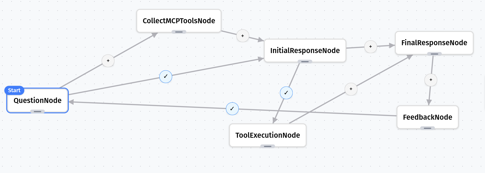

# Tool-Calling with MCP

## The Problem

Modern AI applications need to interact with external tools to solve complex problems. Whether it's performing calculations, accessing databases, or calling APIs, we need a standardized way for LLMs to discover and use these tools.

## Solution with Grapheteria

Grapheteria makes building tool-using workflows simple with MCP (Model Context Protocol). Here's what we'll build:

- **User Input**: A user asks a question requiring external tools
- **MCP Connection**: System connects to a tool server
- **LLM Planning**: Claude decides which tools to use
- **Tool Execution**: System executes the selected tool via MCP
- **Response Synthesis**: Claude interprets tool results and answers the question

### First, let's create our MCP server with powerful tools

Let's set up an MCP server with a few example tools. While these demonstrations are straightforward, you can implement tools with any level of complexity your application requires:

```python
# mcp_server.py
from fastmcp import FastMCP

# Create a named server
mcp = FastMCP("Claude Tool Server")

@mcp.tool()
def calculate(expression: str) -> float:
    """Evaluate a mathematical expression safely"""
    # In a real application, use a safer evaluation method
    return eval(expression, {"__builtins__": {}}, {"abs": abs, "round": round, "max": max, "min": min})

@mcp.tool()
def get_country_info(country: str) -> dict:
    """Get basic information about a country"""
    countries = {
        "france": {"capital": "Paris", "population": "67 million", "language": "French"},
        "japan": {"capital": "Tokyo", "population": "126 million", "language": "Japanese"},
        "brazil": {"capital": "Brasília", "population": "213 million", "language": "Portuguese"},
    }
    return countries.get(country.lower(), {"error": "Country not found"})

@mcp.tool()
def convert_units(value: float, from_unit: str, to_unit: str) -> float:
    """Convert between common units"""
    conversions = {
        "km_to_miles": 0.621371,
        "miles_to_km": 1.60934,
        "kg_to_lb": 2.20462,
        "lb_to_kg": 0.453592,
        "celsius_to_fahrenheit": lambda x: x * 9/5 + 32,
        "fahrenheit_to_celsius": lambda x: (x - 32) * 5/9,
    }
    
    key = f"{from_unit.lower()}_to_{to_unit.lower()}"
    if key in conversions:
        converter = conversions[key]
        if callable(converter):
            return converter(value)
        return value * converter
    return {"error": "Conversion not supported"}

# Start the server
if __name__ == "__main__":
    mcp.run()
```

### Let's create our utility functions

```python
# utils.py
from functools import lru_cache
from typing import Dict, Any, List
from anthropic import Anthropic
from dotenv import load_dotenv
import os

load_dotenv()  # load environment variables from .env

@lru_cache(maxsize=1)
def get_llm_client():
    return Anthropic(api_key=os.environ.get("ANTHROPIC_API_KEY"))

def call_llm(messages: List[Dict[str, Any]], tools: List[Dict[str, Any]]) -> str:
    llm_client = get_llm_client()
    response = llm_client.messages.create(
            model="claude-3-5-sonnet-20241022",
            max_tokens=1000,
            messages=messages,
            tools=tools
        )
    return response
```

### Now, let's define our workflow nodes

```python
# nodes.py
import asyncio
from mcp import ClientSession, StdioServerParameters, stdio_client
from utils import call_llm
from grapheteria import Node

class QuestionNode(Node):
    async def prepare(self, shared, request_input):
        question = await request_input(
            prompt="What would you like to know?",
            input_type="text"
        )

        shared["question"] = question
        shared["messages"] = shared.get("messages", [])
        shared["messages"].append({
            "role": "user",
            "content": question
        })

class CollectMCPToolsNode(Node):
    async def prepare(self, shared, _):
        server_params = StdioServerParameters(
        command="python",
        args=["examples/mcp_tool_calling/mcp_server.py"],
        )

        async with stdio_client(server_params) as (read, write):
            async with ClientSession(read, write) as session:
                # Initialize the connection
                await session.initialize()
                # Get tools
                response = await session.list_tools()
        
        shared["tools"] = [{
                    "name": tool.name,
                    "description": tool.description,
                    "input_schema": tool.inputSchema
                } for tool in response.tools]  
        shared["collected_tools"] = True
        
class InitialResponseNode(Node):
    def prepare(self, shared, request_input):
        tools = shared["tools"]
        messages = shared["messages"]
        return tools, messages
        
    def execute(self, prep_result):             
        tools, messages = prep_result
              
        response = call_llm(messages, tools)
    
        return response
    
    def cleanup(self, shared, prep_result, exec_result): 
        tool_calls = []
        for content in exec_result.content:
            if content.type == 'tool_use':
                tool_call = {
                    "id": content.id,
                    "name": content.name,
                    "input": content.input
                }
                tool_calls.append(tool_call)

        shared["tool_calls"] = tool_calls
        messages = shared["messages"]
        messages.append({
            "role": "assistant",
            "content": exec_result.content
        })
        shared["messages"] = messages

#Parallel Tool Execution
class ToolExecutionNode(Node):
   def prepare(self, shared, request_input):    
        tool_calls = shared["tool_calls"]
        return tool_calls
    
    async def _execute_with_retry(self, items):
        # Process all items in parallel
        tasks = [self._process_item(item) for item in items]
        results = await asyncio.gather(*tasks, return_exceptions=True)
        
        # Check for exceptions
        for result in results:
            if isinstance(result, Exception):
                raise result
                
        return results

    async def execute(self, prep_result):
        tool_id, tool_name, tool_input = prep_result['id'], prep_result['name'], prep_result['input']

        server_params = StdioServerParameters(
        command="python",
        args=["examples/mcp_tool_calling/mcp_server.py"],
        )

        async with stdio_client(server_params) as (read, write):
            async with ClientSession(read, write) as session:
                # Initialize the connection
                await session.initialize()
                # Execute the tool
                result = await session.call_tool(tool_name, tool_input)

        
        return {
            "tool_use_id": tool_id,
            "result": result.content
        }
    
    def cleanup(self, shared, prep_result, exec_result):
        for result in exec_result:
            shared["messages"].append({
                "role": "user",
                "content": [
                    {
                        "type": "tool_result",
                        "tool_use_id": result["tool_use_id"],
                        "content": result["result"]
                    }
                ]
            })

class FinalResponseNode(Node):
    def prepare(self, shared, request_input):
        messages = shared["messages"]
        tools = shared["tools"]

        return messages, tools
    
    def execute(self, prep_result): 
        messages, tools = prep_result
        # Get final response from Claude
        response = call_llm(messages, tools)
        return response.content[0].text
    
    def cleanup(self, shared, prep_result, exec_result):
        shared["final_response"] = exec_result

class FeedbackNode(Node):
    async def prepare(self, shared, request_input):
        global _mcp_client
        print("\n🔍 Response:\n")
        print(f"Question: {shared['question']}")
        
        print("\nAnswer:")
        print(shared['final_response'])
        
        feedback = await request_input(
            prompt="Was this answer helpful?",
            options=["yes", "no"],
            input_type="select"
        )     
        shared["feedback"] = feedback
```

### Finally, let's define and run our workflow

```python
# main.py
from nodes import *
from grapheteria import WorkflowEngine
import asyncio

# Create nodes
question = QuestionNode(id="question")
collect_mcp_tools = CollectMCPToolsNode(id="collect_mcp_tools")
initial_response = InitialResponseNode(id="initial_response")
tool_execution = ToolExecutionNode(id="tool_execution")
final_response = FinalResponseNode(id="final_response")
feedback = FeedbackNode(id="feedback")

# Connect nodes to form workflow
question > collect_mcp_tools > initial_response > final_response
question - "shared.get('collected_tools', False) == True" > initial_response
initial_response - "shared.get('tool_calls', False)" > tool_execution > final_response
final_response > feedback
feedback - "shared['feedback'] == 'no'" > question

# Create the workflow engine    
workflow = WorkflowEngine(
    workflow_id="mcp_tool_calling",
    nodes=[question, collect_mcp_tools, initial_response, tool_execution, final_response, feedback],
    start=question
)

async def run_workflow():
    user_input = None
    
    while True:
        continue_workflow = await workflow.run(user_input)
        
        # If workflow is waiting for input
        if workflow.execution_state.awaiting_input:
            request = workflow.execution_state.awaiting_input
            request_id = request['request_id']
            prompt = request['prompt']
            
            print(f"\n[Input required] {prompt}")
            
            if request['input_type'] == 'select':
                for i, option in enumerate(request['options']):
                    print(f"{i+1}. {option}")
                choice = input("Enter your choice (number): ")
                user_input = request['options'][int(choice)-1]
            else:
                user_input = input("Your response: ")
            
            await workflow.step({request_id: user_input})
        elif not continue_workflow:
            break
            
if __name__ == "__main__":
    print("🧠 Claude Research Assistant with MCP Tools")
    print("------------------------------------------")
    print("Ask me anything! I can use tools to help you.")
    
    # Run the workflow
    asyncio.run(run_workflow())
```

### Workflow JSON Schema

```json
{
    "start": "question",
    "nodes": [
      { "id": "question", "class": "QuestionNode" },
      { "id": "collect_mcp_tools", "class": "CollectMCPToolsNode" },
      { "id": "initial_response", "class": "InitialResponseNode" },
      { "id": "tool_execution", "class": "ToolExecutionNode" },
      { "id": "final_response", "class": "FinalResponseNode" },
      { "id": "feedback", "class": "FeedbackNode" }
    ],
    "edges": [
      { "from": "question", "to": "collect_mcp_tools" },
      { "from": "collect_mcp_tools", "to": "initial_response" },
      { "from": "question", "to": "initial_response", "condition": "shared.get('collected_tools', False) == True" },
      { "from": "initial_response", "to": "final_response" },
      { "from": "initial_response", "to": "tool_execution", "condition": "shared.get('tool_calls', False)" },
      { "from": "tool_execution", "to": "final_response" },
      { "from": "final_response", "to": "feedback" },
      { "from": "feedback", "to": "question", "condition": "shared['feedback'] == 'no'" }
    ]
  }
  
```

## Setup

```bash
# Install dependencies
pip install grapheteria fastmcp anthropic mcp python-dotenv

# Set your Anthropic API key in the .env file
echo "ANTHROPIC_API_KEY=your-api-key-here" > .env

# Run the workflow
python main.py
```

## Key Features Demonstrated

- **Granular Steps** - Each part of the process has its own dedicated node
- **MCP Protocol** - Standard protocol for model-tool interaction
- **State Propagation** - Tool results and conversation history flow through shared state
- **Visual Workflow** - Entire tool-use cycle visualized in the Grapheteria UI
- **Claude Integration** - Direct access to Claude's powerful tool-use capabilities

As always, run `grapheteria` in your terminal to launch the UI and visualize/run/debug this workflow.



The entire code for this example, along with deployment instructions, is available <a href="https://github.com/beubax/grapheteria/examples/mcp_tool_calling" target="_blank">here</a>. This pattern gives you maximum visibility into each stage of the tool-use process, making it perfect for debugging or adding custom logic at any point in the workflow!
