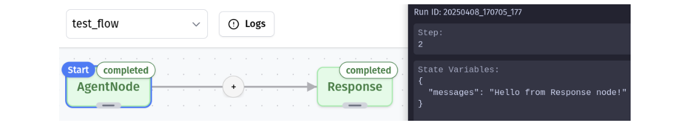

# Debug Mode

## Overview
Debug Mode is Grapheteria's most powerful feature, making workflow development dramatically easier. When mistakes happen (and they will!), Debug Mode helps you identify and fix issues with minimal frustration through its live state visualization and time-travel capabilities.

## Visual Elements

### State Visualization
Debug Mode reveals the shared state that nodes read from and write to, giving you visibility into your workflow's data at each step of execution.

### Node Status Indicators
The canvas displays each node's current status:
- **Queued**: Next in line for execution
- **Pending**: Currently being processed
- **Completed**: Successfully executed
- **Failed**: Encountered an error

## Time Travel Controls

Debug Mode's control panel gives you precise control over workflow execution:

- **Step**: Execute a single step in the workflow
- **Run**: Progress to the next halt stage (completion or waiting node)
- **Prev**: Travel back to a previous state
- **Next**: Move forward to a future state (if available)

### Time Travel Superpowers
Found a bug? No need to restart! Simply:
1. Go back in time with **Prev**
2. Fix the problematic code
3. Resume with **Step** or **Run**

Your workflow picks up exactly where you left off. When stepping forward, future states are overwritten with the new execution path, keeping your debug session consistent.

## Node Operations During Debugging

### Deletion Rules
To maintain logical consistency during time travel:
- Nodes that have completed, failed, or are waiting for input cannot be removed
- To delete a problematic node, travel back to before it executed, then remove it

### Addition Freedom
Feel free to add new nodes or edges at any point in the debugging process—even after a workflow has completed. Then step forward to see how they affect execution!

## Providing Input During Debugging

### Input Requests
Some nodes in your workflow might need human input to continue processing. When execution reaches one of these nodes, you'll see:
- A **waiting_for_input** badge on the node
- Input request details displayed in the node's info panel

No amount of clicking **Step** or **Run** will advance the workflow until the required input is provided—the machine patiently waits for your wisdom!

### Supplying Input Data
To satisfy a waiting node's hunger for data:

1. Click the **Configure Input Data** button at the bottom of the debug panel
2. This opens a modal where you can provide the requested information
3. For your convenience, the modal pre-populates the request ID that's currently waiting
4. Enter your input value (which can be text, numbers, or even structured data depending on the node)
5. Submit the input to let the workflow continue its journey

After providing input, the node transitions from its waiting state and the workflow resumes execution. You can then continue stepping through your workflow as normal.

## Error Handling

Debug Mode displays error messages and exceptions directly in the UI, making it easy to identify what went wrong and where.

Common errors include invalid inputs, missing connections, or logic problems in your code. With time travel, you can step back, fix the issue, and continue without restarting.

## Known Issues

Sometimes you might encounter persistent errors (like a corrupted state save) where even error messages get stuck in a loop. In these cases, it's best to start a fresh debug session after fixing the underlying issue.

For solutions to common problems, check the [Troubleshooting Guide](./Troubleshooting).
