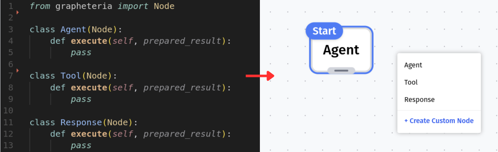
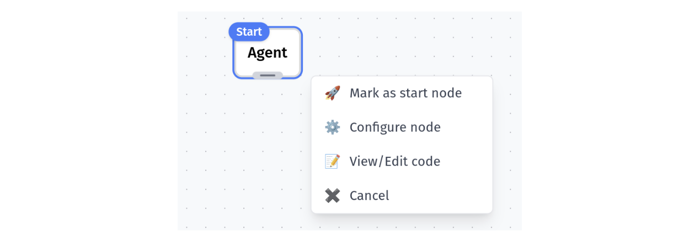
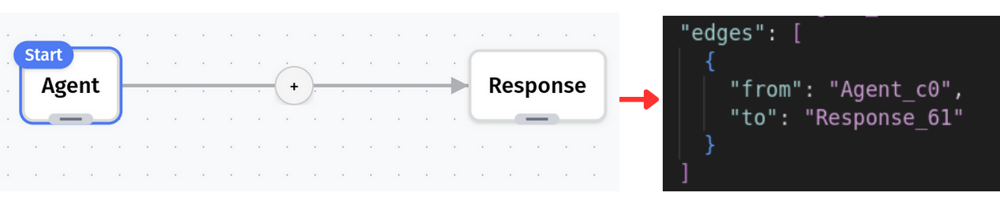
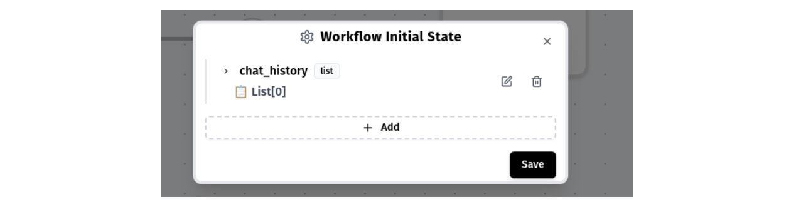
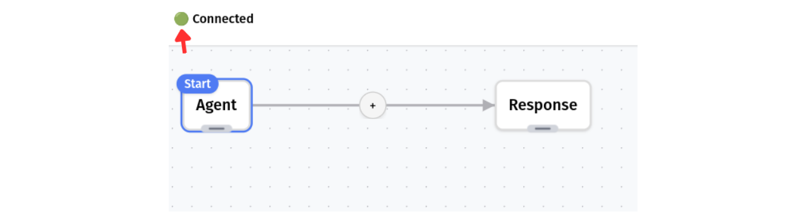
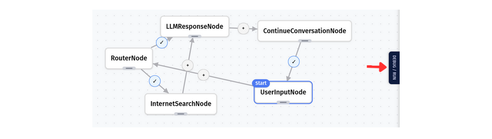

# The UI: Visual Workflow Manager

## Discovering Your Components

When launched, the server automatically scans your working directory for:
- Any nodes you've created (classes extending the Node class)
- Existing workflows (stored as JSON files)

Everything is instantly available in your browser - no manual importing needed!

## Canvas: Your Workflow Playground

After selecting or creating a workflow, you'll see your canvas - the blank slate for your state machine.

Need to add nodes? Just right-click anywhere on the canvas to see all available nodes. Each node you add automatically updates your workflow's JSON schema.

> The UI automatically assigns a unique ID to each node in the JSON schema. If you wish to modify them, please ensure that they are unique and that the changes are reflected in the edges as well.
{: .note}
## Building Your State Machine

### Adding and Configuring Nodes
Add as many nodes as your workflow needs. Right-click on any node to:
- Set it as the start node
- Modify its configuration
- View its source code
- And more!

### Creating Connections
Connect your nodes by dragging from the center of one node to another. An edge appears, linking them together - and yes, your JSON file updates in real-time!

### Removing Components
To delete a node or edge:
- Double-click on a node's handle (the same handle lets you drag nodes around)
- Double-click anywhere on an edge to remove it

### Edge Configuration
Edges aren't just connections - click the button on any edge to add transition conditions.

## Setting Initial State

Look for the button at the bottom of your canvas to set your workflow's initial state - crucial for proper execution!

## Real-Time Synchronization

Keep an eye on the connection icon in the top left. Green means you're connected and changes are syncing to your JSON file.

The UI only shows what's actually in your schema. If something doesn't appear as expected, check the connection status - your progress is always safe.

## Ready to Run

Once your workflow looks good, head to the debug/run tab on the middle right of the screen. There you can test your state machine and see it in action!

[Learn more about debugging and running workflows](./Debug)

## Troubleshooting

Having issues? Check out our troubleshooting guide for common problems and solutions.

[Troubleshooting Guide](./Troubleshooting)