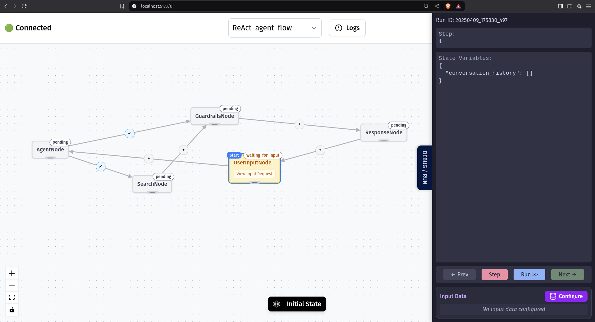

Welcome to the visual side of Grapheteria! The UI connects to your codebase through websockets, making your workflow design interactive and intuitive.

To get started, run this command in your terminal:

```console
grapheteria
```

This simple command launches both the server and UI. Now you can visually manage all your nodes, create connections, configure them, and debug your workflows with ease!

