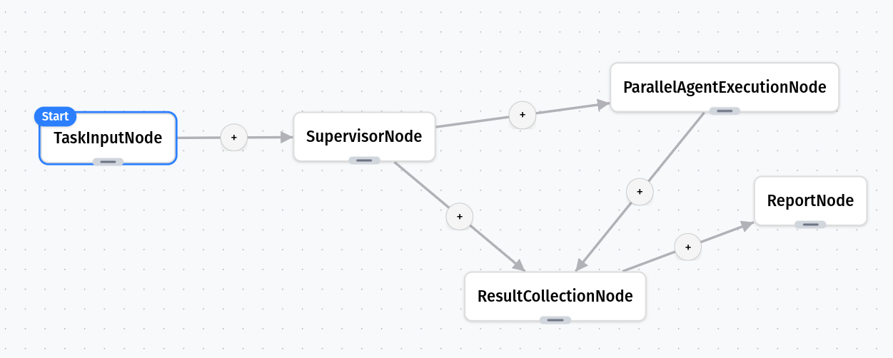
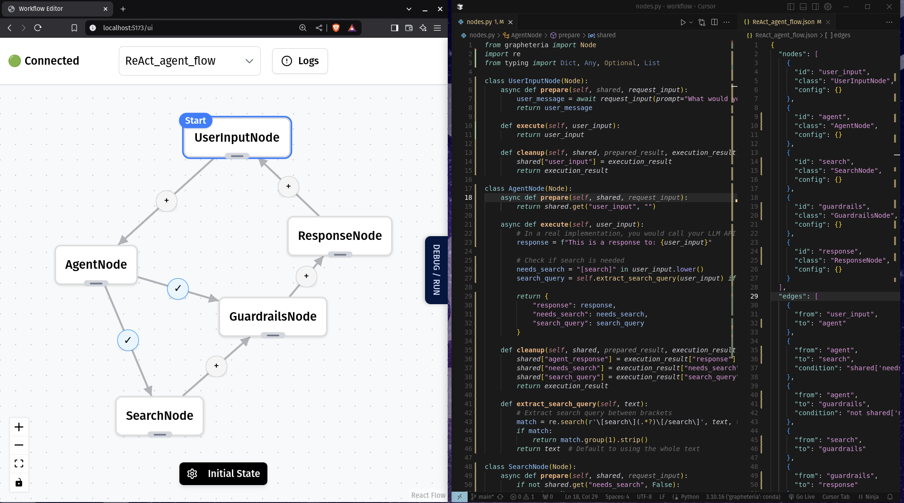
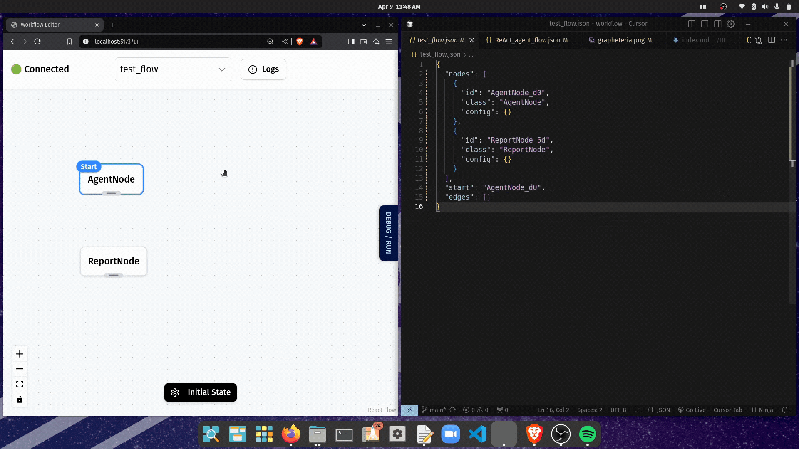
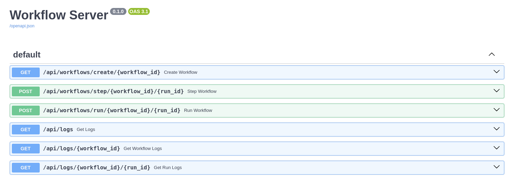

# Welcome to Grapheteria!

Thanks for checking out this project! We're excited to show you what we've built.

## What is Grapheteria?

Grapheteria is a no-bs library for creating agentic workflows. It helps you design, visualize, and execute complex processes with minimal fuss.


<!-- An illustration showing a workflow with nodes, edges, and agents working together -->

"Oh no, not ANOTHER workflow library!" - I hear you. But being late to the game has its advantages. We've learned from others' mistakes and borrowed their best ideas, while introducing some genuinely new features.

## Why Grapheteria?

While there are standards for agent creation and tool-calling, workflow creation remains fragmented. Grapheteria aims to change that with a clean, generic framework that provides essential features while remaining infinitely extensible.

### Problems with Existing Tools

**Code-based workflow builders** often drown you in abstractions:
- "Wait, what does this wrapper do again?" 
- "How many layers of inheritance am I dealing with?"
- "I just want to see what's happening!"

**UI-only tools** hit a ceiling:
- Limited customization for complex scenarios
- Multi-agent setups become impossible
- You eventually end up back in code anyway

## The Vision: Best of Both Worlds

Grapheteria seamlessly blends code and UI. Freely move between visual design and code customization without compromise. Get the full power of code with the clarity of visual debugging.


<!-- An animated GIF showing changes in code immediately reflected in the UI and vice versa -->


{: .note }
Grapheteria uses state machines to define workflows - a powerful pattern that makes complex processes manageable and predictable. [Learn more about state machines in Grapheteria](Concepts/state_machines).


## Standout Features

### Clean, Simple Code
Write workflows without learning a complex API first:

```python
start_node = InputNode(id="get_name")
process_node = ProcessNode(id="greet")
output_node = OutputNode(id="display")

start_node > process_node > output_node
```

### Visual Workflow Design

<!-- A screenshot of the Grapheteria workflow editor with nodes, edges, and a properties panel -->

Edit your workflows visually or programmatically - they stay in sync!

### Time-Travel Debugging
Made a mistake? No problem:
- Step backwards in your workflow
- Fix the issue
- Step forwards
- Continue from exactly where you left off


<!-- An animated GIF showing someone debugging, going back in time, fixing a node, and continuing -->

### Built-in Essentials
- Comprehensive logging
- Automatic state persistence
- Easy resumption of workflows


<!-- A screenshot showing logs and state persistence in action -->

### Production-Ready Path
From prototype to production with minimal changes:
- Scale from local to distributed execution
- Monitor and track workflow performance
- Handle errors gracefully


<!-- An illustration showing workflow scaling from local to distributed environments -->

### Vibe-Coding Compatible
Describe what you want, then refine:
- Generate workflow skeletons with AI
- Modify rather than starting from scratch
- Rapidly prototype complex workflows


<!-- An animated GIF showing a text prompt being turned into a workflow -->

## Ready to Try It?

### Installation

```bash
# Create a virtual environment (recommended)
python -m venv venv
source venv/bin/activate  # On Windows: venv\Scripts\activate

# Install Grapheteria
pip install grapheteria
```

> **Note:** Grapheteria requires Python 3.6 or higher.
{: .note}

### Launch the UI

Once installed, launch the UI with:

```bash
grapheteria
```

This will start the Grapheteria interface and automatically sync with your codebase.

<div class="d-flex justify-content-center mt-4">
  <a href="Core" class="btn btn-primary btn-sm px-3 py-2 mb-4">Learn Core Concepts →</a>
</div>


